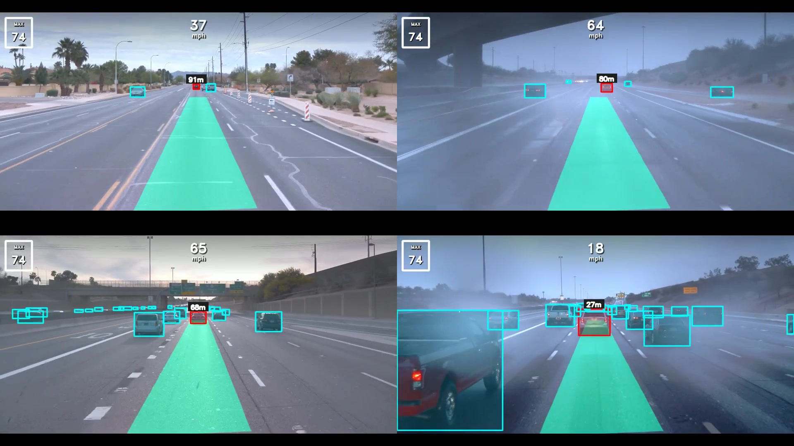

# VisionPilot Docker Reproduction

<p align="center">
  <a href="https://youtu.be/XA46OzToAPA">
    
  </a>
</p>

<p align="center">
  <b>Watch the 2x2 OpenLane reproduction video on YouTube:</b><br>
  <a href="https://youtu.be/XA46OzToAPA">https://youtu.be/XA46OzToAPA</a>
</p>

This repository is my Docker-based reproduction of the Autoware Foundation
[vision_pilot](https://github.com/autowarefoundation/vision_pilot) project.

The purpose of this fork is to document a working reproduction process, make the
project easier to rerun on another Docker-enabled machine, and provide a clean
starting point for future modifications.

## What Has Been Reproduced

The project has been successfully built and run in a Docker GPU environment.

Current reproduction status:

- Built the GPU Docker image: `visionpilot:gpu`
- Ran VisionPilot inside Docker with CUDA inference
- Loaded all three ONNX models successfully:
  - `autodrive_fp32.onnx`
  - `autosteer_fp32.onnx`
  - `autospeed_fp32.onnx`
- Added headless execution support for SSH/server environments
- Added video export support so the visualization output can be saved as `.mp4`
- Ran multiple OpenLane sample videos
- Generated a 2x2 comparison video as the repository showcase

Showcase files:

```text
output/openlane_2x2_grid.jpg
output/openlane_2x2_grid.mp4
output/openlane_results/
```

## Reproduction Environment

The reproduction was completed on the following machine:

```text
OS: Ubuntu 24.04.3 LTS
GPU: NVIDIA GeForce RTX 4060 Ti
NVIDIA Driver: 580.159.03
Container CUDA version: 13.0
Docker image: visionpilot:gpu
```

Other NVIDIA GPUs should also work, as long as the host machine supports Docker
GPU passthrough.

Before building VisionPilot, make sure these commands work on the host machine:

```bash
nvidia-smi
docker --version
sudo docker run --rm --gpus all nvcr.io/nvidia/cuda:13.0.0-runtime-ubuntu24.04 nvidia-smi
```

If the last command cannot see the GPU inside Docker, fix the NVIDIA driver,
Docker installation, or NVIDIA Container Toolkit before continuing.

## Repository Layout

The repository is organized so that source code, inputs, outputs, logs, and
helper scripts are easy to find:

```text
vision_pilot/
├── VisionPilot/                 # Main VisionPilot source tree
├── input/                       # Input videos and speed files
│   └── openlane_sample/
│       ├── input.mp4
│       └── frame_speed.txt
├── output/                      # Generated result videos
│   ├── openlane_2x2_grid.jpg
│   ├── openlane_2x2_grid.mp4
│   └── openlane_results/
├── data/                        # Temporary or intermediate data
├── logs/                        # Build logs, run logs, and backup files
└── tools/                       # Helper scripts used during setup
```

Recommended convention:

- Put new input videos under `input/<dataset_name>/`
- Put generated result videos under `output/`
- Put logs under `logs/`
- Put one-off helper scripts under `tools/`

## Fresh Reproduction on Another Machine

The steps below assume you are using an Ubuntu machine with Docker and an NVIDIA
GPU.

### 1. Clone This Repository

```bash
git clone https://github.com/130070/vision_pilot.git
cd vision_pilot
```

### 2. Prepare ONNX Runtime

To avoid slow or unstable downloads during Docker build, this fork expects the
ONNX Runtime archive to be available locally.

Place the archive here:

```text
VisionPilot/docker/ort.tgz
```

Required version:

```text
ONNX Runtime GPU 1.26.0
```

Recommended download from this repository release:

```text
https://github.com/130070/vision_pilot/releases/download/v1.1/onnxruntime-linux-x64-gpu-1.26.0.tgz
```

Alternative official download:

```text
https://github.com/microsoft/onnxruntime/releases/download/v1.26.0/onnxruntime-linux-x64-gpu-1.26.0.tgz
```

On the server, download the release asset and save it as `ort.tgz`:

```bash
cd VisionPilot/docker
wget -O ort.tgz https://github.com/130070/vision_pilot/releases/download/v1.1/onnxruntime-linux-x64-gpu-1.26.0.tgz
```

If GitHub downloads are slow on the server, download the file on another machine
and copy it to the server as `ort.tgz`:

```powershell
scp "D:\path\to\onnxruntime-linux-x64-gpu-1.26.0.tgz" user@server:~/vision_pilot/VisionPilot/docker/ort.tgz
```

Do not commit `ort.tgz` to a normal GitHub repository. It is a large binary
dependency and should be downloaded separately or managed with Git LFS.

### 3. Build the Docker Image

```bash
cd ~/vision_pilot/VisionPilot/docker
sudo ./build.sh --gpu
```

Expected final message:

```text
Build complete: visionpilot:gpu
```

Check the image:

```bash
sudo docker images | grep visionpilot
```

### 4. Verify GPU Access Inside the Container

```bash
sudo docker run --rm --gpus all --entrypoint /bin/bash visionpilot:gpu -lc "nvidia-smi"
```

If `nvidia-smi` works inside the container, the Docker GPU setup is ready.

## Run the Provided Sample

VisionPilot video mode needs two input files:

```text
input.mp4           # Input video
frame_speed.txt     # Vehicle speed values, one value per line
```

The current sample input is stored at:

```text
input/openlane_sample/input.mp4
input/openlane_sample/frame_speed.txt
```

Run the sample and save the output video:

```bash
cd ~/vision_pilot/VisionPilot/docker
sudo ./run.sh --gpu --no-display \
  --data ~/vision_pilot/input/openlane_sample:/data \
  --output-video ~/vision_pilot/output/openlane_result.mp4
```

What the arguments mean:

```text
--gpu
    Use the GPU image: visionpilot:gpu

--no-display
    Run without opening a GUI window. This is recommended for SSH/headless servers.

--data ~/vision_pilot/input/openlane_sample:/data
    Mount the host input directory into the container as /data.

--output-video ~/vision_pilot/output/openlane_result.mp4
    Save the visualization output to an mp4 file.
```

After the run finishes, the result is saved to:

```text
~/vision_pilot/output/openlane_result.mp4
```

## Important Configuration Files

Main configuration files:

```text
VisionPilot/config/vision_pilot.conf
VisionPilot/config/vision_pilot_test.conf
VisionPilot/config/H.yaml
```

Key settings in `vision_pilot.conf`:

```conf
source.mode         = video
engine.provider     = cuda
visualization_on    = false
```

Supported values for `engine.provider`:

```text
cpu | cuda | tensorrt
```

This reproduction uses:

```conf
engine.provider     = cuda
```

Key settings in `vision_pilot_test.conf`:

```conf
source.input_video         = /data/input.mp4
source.input_vehicle_speed = /data/frame_speed.txt
source.dataset             = open_lane
```

These are container paths. The host directory is mounted to `/data` by `run.sh`.

## Run Your Own Dataset

A VisionPilot video dataset directory should contain:

```text
input/<dataset_name>/
├── input.mp4
├── frame_speed.txt
└── H.yaml              # Optional but recommended for custom camera viewpoints
```

`run.sh` automatically checks the mounted dataset directory. If
`input/<dataset_name>/H.yaml` exists, it is mounted into the container and used
for that run. If it does not exist, the default `VisionPilot/config/H.yaml` is
used.

### 1. Upload an Existing Dataset

From Windows PowerShell:

```powershell
scp "D:\chrome\test_open_lane_2\input.mp4" user@server:~/vision_pilot/input/test_open_lane_2/input.mp4
scp "D:\chrome\test_open_lane_2\frame_speed.txt" user@server:~/vision_pilot/input/test_open_lane_2/frame_speed.txt
scp "D:\chrome\test_open_lane_2\H.yaml" user@server:~/vision_pilot/input/test_open_lane_2/H.yaml
```

If the dataset does not provide `H.yaml`, skip the last command.

### 2. Run the Dataset

Keep `vision_pilot_test.conf` using container paths:

```conf
source.input_video         = /data/input.mp4
source.input_vehicle_speed = /data/frame_speed.txt
```

Then run:

```bash
cd ~/vision_pilot/VisionPilot/docker
sudo ./run.sh --gpu --no-display \
  --data ~/vision_pilot/input/test_open_lane_2:/data \
  --output-video ~/vision_pilot/output/test_open_lane_2_result.mp4 \
  --output-csv ~/vision_pilot/output/test_open_lane_2_metrics.csv
```

Expected outputs:

```text
output/test_open_lane_2_result.mp4
output/test_open_lane_2_metrics.csv
```

## Custom Video Workflow

This workflow is intended for a phone, action camera, or dashboard-camera style
video. The model can run on these videos, but the result depends strongly on the
camera viewpoint. A dataset-specific `H.yaml` is the first thing to prepare.

### 1. Prepare `input.mp4` and `frame_speed.txt`

If the source video is already on the server, create a dataset directory with:

```bash
cd ~/vision_pilot
python3 tools/prepare_custom_video_dataset.py \
  /path/to/your_video.mp4 \
  input/custom_phone_video \
  --speed 0.0 \
  --overwrite
```

This creates:

```text
input/custom_phone_video/input.mp4
input/custom_phone_video/frame_speed.txt
```

`--speed` is the ego speed in meters per second. Use `0.0` if speed is unknown.
For better longitudinal behavior, replace `frame_speed.txt` later with per-frame
vehicle speed values.

### 2. Extract a Calibration Frame

Choose a frame where lane markings or road edges are clearly visible:

```bash
python3 tools/extract_calibration_frame.py \
  input/custom_phone_video/input.mp4 \
  input/custom_phone_video/calibration_frame.jpg \
  --time 2.0
```

Open `calibration_frame.jpg` and record four pixel points in this order:

```text
near-left, near-right, far-left, far-right
```

The near points should be on the left and right lane boundaries near the vehicle.
The far points should be on the same boundaries farther ahead.

### 3. Generate Dataset-Specific `H.yaml`

Example:

```bash
python3 tools/generate_h_yaml_from_points.py \
  --image-point 420,690 \
  --image-point 880,690 \
  --image-point 585,430 \
  --image-point 735,430 \
  --lane-width 3.6 \
  --near-distance 6.0 \
  --far-distance 30.0 \
  --output input/custom_phone_video/H.yaml \
  --preview-image input/custom_phone_video/calibration_frame.jpg \
  --preview-output input/custom_phone_video/calibration_preview.jpg
```

The generated `H.yaml` maps raw image pixels to road coordinates. The preview
image is only for checking that the selected points are in the intended order.

### 4. Run the Custom Video

```bash
cd ~/vision_pilot/VisionPilot/docker
sudo ./run.sh --gpu --no-display \
  --data ~/vision_pilot/input/custom_phone_video:/data \
  --output-video ~/vision_pilot/output/custom_phone_video_result.mp4 \
  --output-csv ~/vision_pilot/output/custom_phone_video_metrics.csv
```

Useful CSV columns include:

```text
frame_id, ego_speed_ms, cte_m, yaw_rad, curvature, cipo_distance_m,
steering_rad, acceleration_ms2, autodrive_ms, autosteer_ms, autospeed_ms
```

Use the CSV file to compare baseline and improved runs instead of judging only by
visual inspection.

## Batch Process Multiple Datasets

If the following directories exist:

```text
input/test_open_lane_2/
input/test_open_lane_5/
input/test_open_lane_6/
input/test_open_lane_10/
```

run all of them with:

```bash
cd ~/vision_pilot

for name in test_open_lane_2 test_open_lane_5 test_open_lane_6 test_open_lane_10; do
  echo "Processing ${name}"

  sudo ./VisionPilot/docker/run.sh --gpu --no-display \
    --data "$PWD/input/${name}:/data" \
    --output-video "$PWD/output/${name}_result.mp4" \
    --output-csv "$PWD/output/${name}_metrics.csv"
done
```

Expected outputs:

```text
output/test_open_lane_2_result.mp4
output/test_open_lane_2_metrics.csv
output/test_open_lane_5_result.mp4
output/test_open_lane_5_metrics.csv
output/test_open_lane_6_result.mp4
output/test_open_lane_6_metrics.csv
output/test_open_lane_10_result.mp4
output/test_open_lane_10_metrics.csv
```

## Create a 2x2 Comparison Video

The server needs `ffmpeg`:

```bash
ffmpeg -version
```

Create a 2x2 video:

```bash
cd ~/vision_pilot

ffmpeg -y \
  -i output/test_open_lane_2_result.mp4 \
  -i output/test_open_lane_5_result.mp4 \
  -i output/test_open_lane_6_result.mp4 \
  -i output/test_open_lane_10_result.mp4 \
  -filter_complex "[0:v]scale=960:540:force_original_aspect_ratio=decrease,pad=960:540:(ow-iw)/2:(oh-ih)/2,setsar=1,setpts=PTS-STARTPTS[v0];[1:v]scale=960:540:force_original_aspect_ratio=decrease,pad=960:540:(ow-iw)/2:(oh-ih)/2,setsar=1,setpts=PTS-STARTPTS[v1];[2:v]scale=960:540:force_original_aspect_ratio=decrease,pad=960:540:(ow-iw)/2:(oh-ih)/2,setsar=1,setpts=PTS-STARTPTS[v2];[3:v]scale=960:540:force_original_aspect_ratio=decrease,pad=960:540:(ow-iw)/2:(oh-ih)/2,setsar=1,setpts=PTS-STARTPTS[v3];[v0][v1][v2][v3]xstack=inputs=4:layout=0_0|960_0|0_540|960_540:shortest=1[v]" \
  -map "[v]" -an -c:v libx264 -preset veryfast -crf 20 -pix_fmt yuv420p \
  output/openlane_2x2_grid.mp4
```

Layout:

```text
Top-left:     test_open_lane_2
Top-right:    test_open_lane_5
Bottom-left:  test_open_lane_6
Bottom-right: test_open_lane_10
```

Create a README cover image from the video:

```bash
ffmpeg -y -ss 00:00:02 -i output/openlane_2x2_grid.mp4 \
  -frames:v 1 -q:v 2 output/openlane_2x2_grid.jpg
```

## Download Results from the Server

From Windows PowerShell:

```powershell
scp user@server:~/vision_pilot/output/openlane_result.mp4 "D:\chrome\openlane_result.mp4"
scp user@server:~/vision_pilot/output/openlane_2x2_grid.mp4 "D:\chrome\openlane_2x2_grid.mp4"
```

Change the filenames if your outputs use different names.

## Common Issues

### No Video Window Appears

If the command includes:

```bash
--no-display
```

no GUI window will be opened. The program will run in headless mode and save the
output video instead.

This is the recommended mode for SSH servers.

### ONNX Runtime Warning About Execution Providers

You may see:

```text
Some nodes were not assigned to the preferred execution providers
```

This is usually not fatal. If the logs show:

```text
[OnnxEngine] provider=cuda
[AutoDrive] Ready
[AutoSteer] Ready
[AutoSpeed] Ready
```

then the models loaded successfully.

### `source.video_path not found`

The paths in `vision_pilot_test.conf` are wrong or the data directory was not
mounted correctly.

Use container paths:

```conf
source.input_video         = /data/input.mp4
source.input_vehicle_speed = /data/frame_speed.txt
```

and run with:

```bash
--data ~/vision_pilot/input/<dataset_name>:/data
```

### `Unknown provider 'gpu'`

`engine.provider` cannot be `gpu`.

Use:

```conf
engine.provider     = cuda
```

### Qt / xcb Display Error

If you see:

```text
qt.qpa.xcb: could not connect to display
```

use:

```bash
--no-display
```

This fork sets the Qt backend automatically in headless mode:

```text
QT_QPA_PLATFORM=offscreen
```

### Docker Build Is Slow or Fails While Downloading

This fork uses a local ONNX Runtime archive:

```text
VisionPilot/docker/ort.tgz
```

If that file is missing, Docker build will fail.

Download it separately and place it at that path before building.

### Do Not Blindly Run `apt autoremove` for NVIDIA Packages

Ubuntu may suggest removing NVIDIA packages with:

```bash
sudo apt autoremove
```

Do not run this unless you know exactly what will be removed. It may break the
GPU driver setup.

## Key Changes Made in This Fork

Compared with the upstream project, this reproduction fork adds or changes:

- Dockerfile uses local `docker/ort.tgz` instead of downloading ONNX Runtime
  during build
- pip installation uses a mirror and longer timeouts
- `run.sh` supports `--output-video`
- `run.sh` supports headless mode with `QT_QPA_PLATFORM=offscreen`
- `run.sh` mounts `H.yaml` into the container
- the main application supports `VISIONPILOT_OUTPUT_VIDEO`
- successful video completion returns exit code `0`
- input, output, logs, and helper scripts are organized for reproduction

## Updating This Repository

After changing code or documentation:

```bash
cd ~/vision_pilot
git status
git add README.md VisionPilot/docker/run.sh VisionPilot/app/vision_pilot.cpp
git commit -m "docs: update reproduction guide"
git push origin main
```

If GitHub asks for a password, use a Personal Access Token instead of your GitHub
account password.

## Credits

This repository is based on the Autoware Foundation
[vision_pilot](https://github.com/autowarefoundation/vision_pilot) project.

Please refer to the upstream project and the `LICENSE` file for original license
and copyright information.
